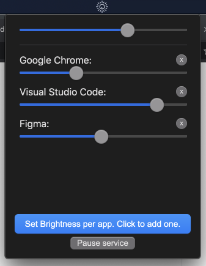

# Program Bright

  
    
  <b>Control brightness of your screen, based on the active window.</b> 
  Available only for macOS for now.

------
 

### What does it do?
Program B's helps you configire different brightness levels for apps in your system. And when the respective app becomes the active window, 'menubar auto brightness' checks if you have configured specifig brightness level for that app and changes the brightness for you automatically.

### How to configure
Its dead simple!
1. Launch the menubar auto brightness app by right-clicking on the app and clicking open.
2. Click on the new menubar icon that appeared.
3. Click on "Set Beightness per app" button and select the app you wanna control beightness when active.
4. Control beightlevel using the sliders.

### Installation
Download the latest version of **menubar auto brightness** on the [Releases](https://github.com/MalayaliRobz/menubar-auto-brightness/releases) page.

